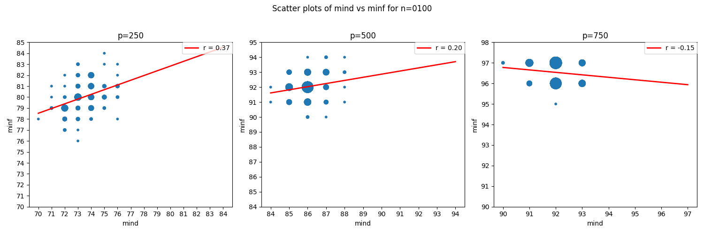
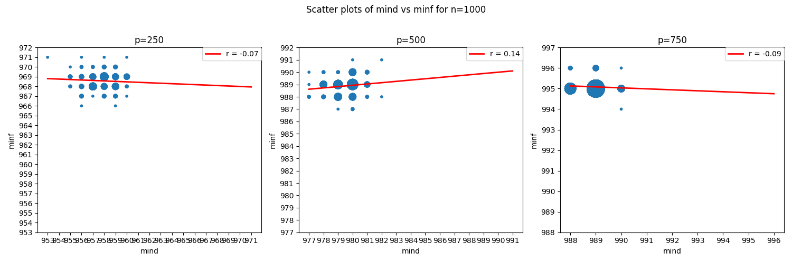
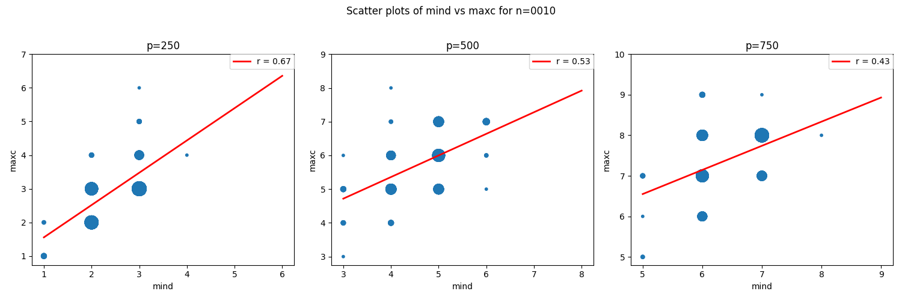
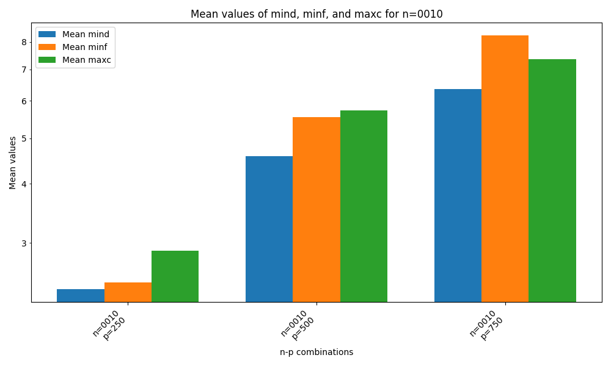
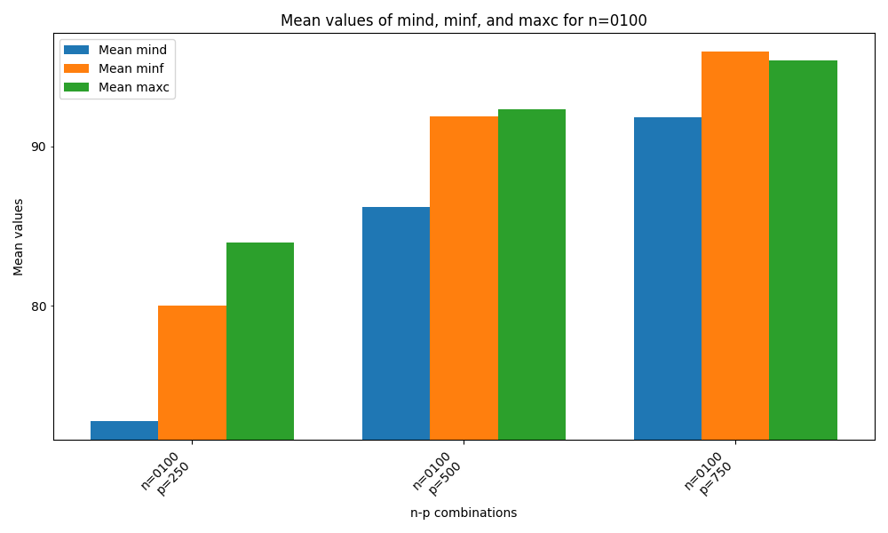
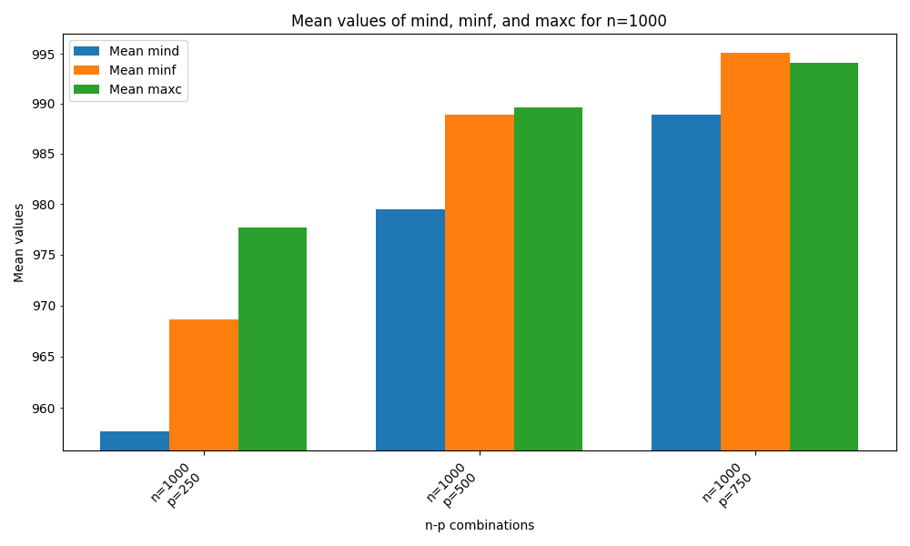
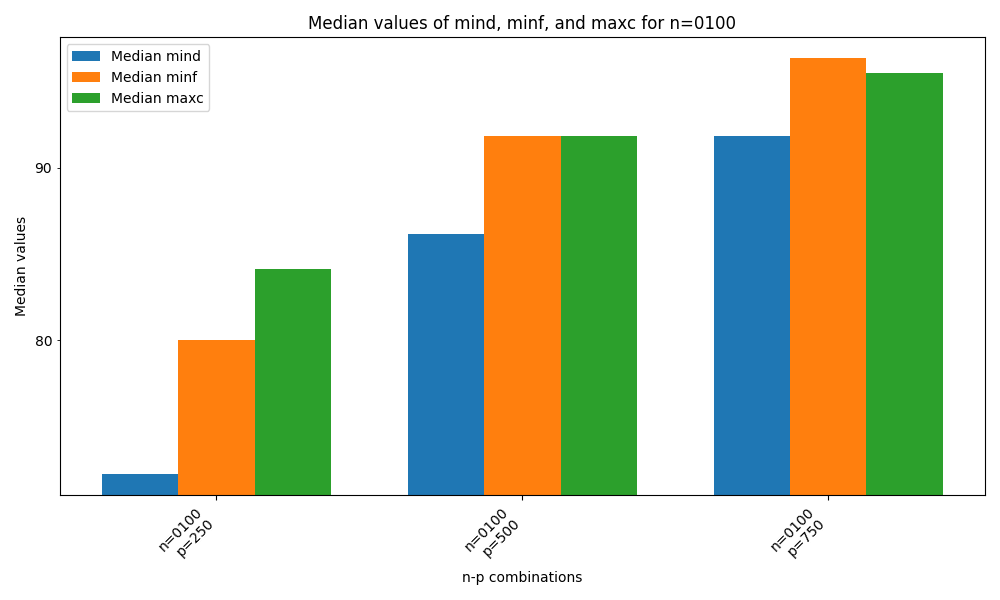

# Treewidth Heuristics Evaluation

In this project, you will find the following pre-computed result artifacts:
- `graphs`: The CSV graphs generated with the `gen` command using $n$ and $p$ value combinations as per the slides ($n \in \{10, 100, 1000\}, p \in \{0.25, 0.5, 0.75\}$)
- `results`: The evaluation results generated with the `eval` command using the graphs in `graphs`
  - Note that the result files also include the mean and median values for each input as the last two rows in the respective CSV file
- `plots`: The result plots generated with the `plot.py` script (which uses the result CSV files stored in `results`)

Note that similar to how floating-point values are used in the CLI application, probabilities are referred to as 250, 500 and 750 instead of 0.25, 0.5 and 0.75 in the filenames and plots.

## Min-Degree vs. Min-Fill-In-Edges

As we can see from these graphs where values are generally concentrated in the top-left corner, the Min-Degree heuristic usually fares quite a bit better than the Min-Fill-In-Edges heuristic in my experiments. Still, we can see that for larger numbers of edges, the Min-Fill-In-Edges heuristic starts to gain on the Min-Degree heuristic as the correlation starts decreasing into negative numbers, i.e., for every graph with a higher treewidth by Min-Degree standards, the corresponding Min-Fill-In-Edges treewidth grows comparatively slower.

At this point, I feel it is worth noting that contrary to some other implementations, my implementation of the Min-Fill-In-Edges does not use any secondary heuristic in case of ties. I have seen that many implementations use the min-degree as a secondary heuristic if two vertices have the same number of fill-in edges. The implementation showcased here strictly returns the first vertex found with the minimum amount of fill-in edges, which might skew the results to some extent.

## Min-Degree vs. Max-Cardinality

For the comparison between the Min-Degree and Max-Cardinality heuristics, we can generally observe very similar results. The only notable difference here is that the Max-Cardinality heuristic does not seem to gain on the Min-Degree heuristic as strongly as the Min-Fill-In-Edges heuristic.

## Min-Fill-In-Edges vs. Max-Cardinality

We can generally observe that the values of the Min-Fill-In-Edges heuristic and those of the Max-Cardinality heuristic are generally significantly closer to each other than those of the Min-Degree heuristic. Still, as we can see in the bottom left (n = 1000, p = 250) that for some graph classes, the Min-Fill-In-Edges heuristic is consistently better than the Max-Cardinality heuristic despite the more pronounced negative correlation. On the other hand, Min-Fill-In-Edges seems to perform worse than Max-Cardinality with an increase in the number of edges in some cases (notice that the values start to shift towards the right side the higher the value of p).

## Means

Overall, the means paint a clear picture of the performance of the three heuristics: In most cases, the Min-Degree heuristic places first, followed by the Min-Fill-In-Edges heuristic with the Max-Cardinality heuristic in last place. However, the performance of the Min-Fill-In-Edges heuristic seems to drastically degrade with an increase in the number of edges. This makes a lot of sense since this lowers the variance of the number of fill-in-edges, and I do not use any secondary heuristic in case of ties.

## Medians

While the median usually reflects the performance of heuristics in contexts like these better due to its resilience towards extreme values, in this case, the median-based statistics seem to nicely align with the overall impressions given by the mean-based statistics. Overall, this can be attributed to the apparent low variance in treewidths of $G(n,p)$ graphs with the same parameterization (same n and p values), leading to very similar treewidths across their respective 100 instances.
